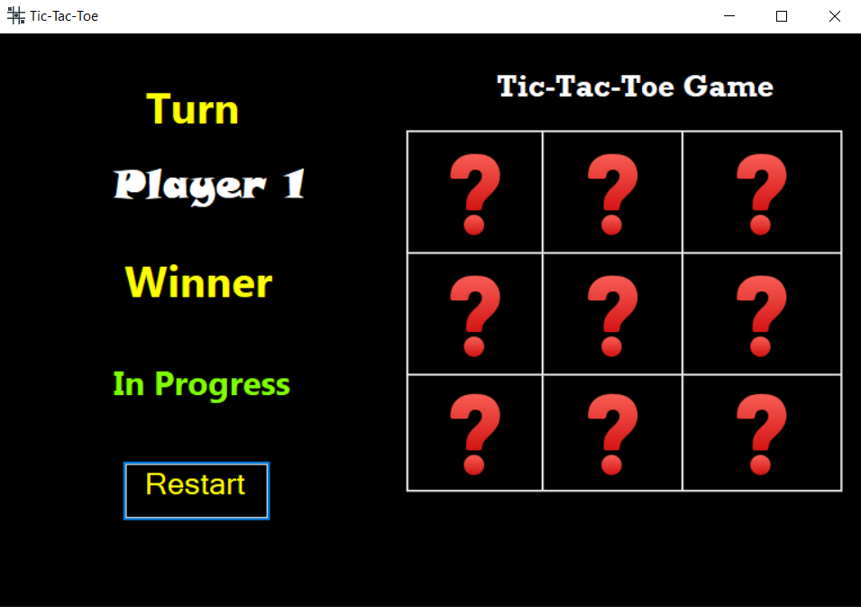

### Tic-Tac-Toe - A Classic Game of Strategy and Fun
<h3></h3>

#### Tic-Tac-Toe is an exciting and interactive implementation of the classic game Tic Tac Toe, built using the .NET platform and Windows Forms with C#. Experience the thrill of strategic gameplay and challenge your friends or the computer to prove your mastery in this timeless game.

# <strong>Features:</strong>

##### 1- Engaging Gameplay: Dive into the world of Tic Tac Toe and enjoy hours of addictive gameplay. Strategize your moves and outmaneuver your opponent to achieve victory.

##### 2- Player vs. Player: Challenge your friends, family, or colleagues to intense battles of Tic Tac Toe. Play on a single device and take turns making your moves to determine the ultimate champion.

##### 3- Interactive Interface: TicTacToeX boasts a visually appealing and user-friendly interface using Windows Forms. The intuitive design allows for seamless gameplay and an enjoyable experience.

###### Whether you're a casual gamer looking for a quick entertainment fix or a developer seeking to enhance your skills in Windows Forms and C#, TicTacToeX provides the perfect playground. Clone this repository and get ready to engage in epic battles of Tic Tac Toe!

###### Note: This project is for educational purposes and can be customized to add additional features or enhance gameplay mechanics. Let your imagination run wild and create your own unique version of Tic Tac Toe.
